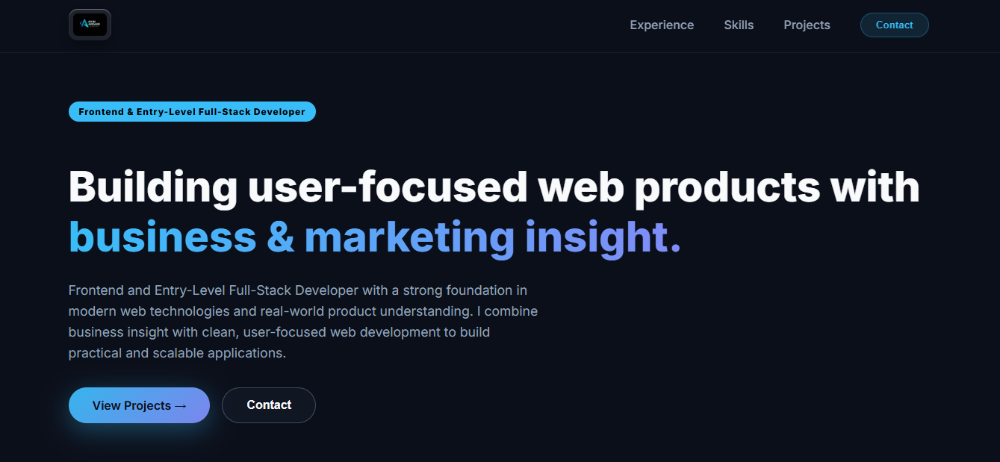
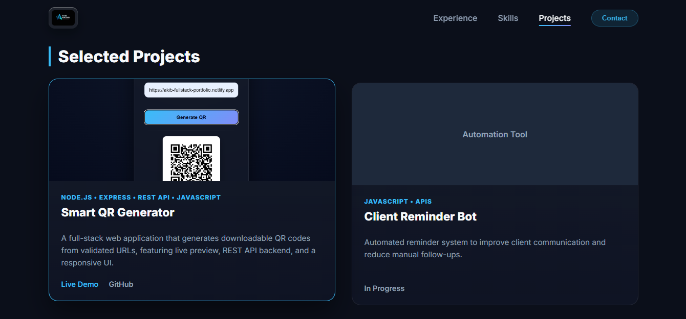

# Full Stack Developer Portfolio

A modern, high-performance **Frontend / Junior Full Stack Developer Portfolio** designed to showcase real-world projects, technical skills, and clean UI craftsmanship. Built with scalability and performance in mind, following industry best practices.

🌐 **Live Portfolios:**  
- **Netlify:** https://akib-fullstack-portfolio.netlify.app/  
- **Vercel:** https://portfolio-fullstack-nine-alpha.vercel.app/

---

## ✨ Overview

This portfolio highlights my journey as a developer, focusing on **clean code**, **responsive design**, and **modern tooling**. The project is structured to be easily extendable and is currently built using modern frontend tooling with scope for future full-stack enhancements.

---

## 🔥 Key Features

- Fully responsive layout (mobile, tablet, desktop)  
- Clean and modern UI with smooth transitions  
- Fast builds and optimized performance using Vite  
- Scalable structure suitable for React-based growth  

---

## 🛠️ Tech Stack

### Frontend
- HTML5  
- CSS3  
- JavaScript (ES6+)  
- React.js  

### Tooling
- Vite  
- Git & GitHub  

### Deployment
- Netlify  
- Vercel  

---

## 📸 Screenshots

### Home Section


### Projects Section


---

## 📦 Installation & Local Setup

1. Clone the repository  
   ```bash
   git clone https://github.com/akibans/portfolio-fullstack.git
   cd portfolio-fullstack
